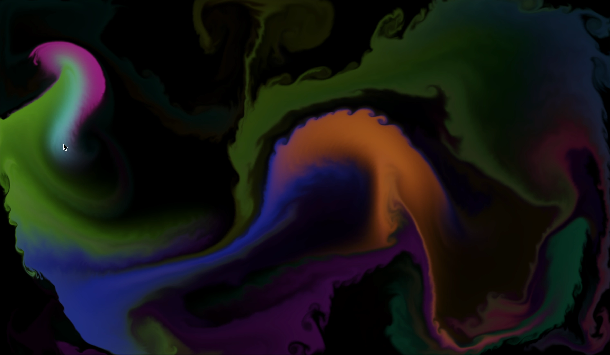
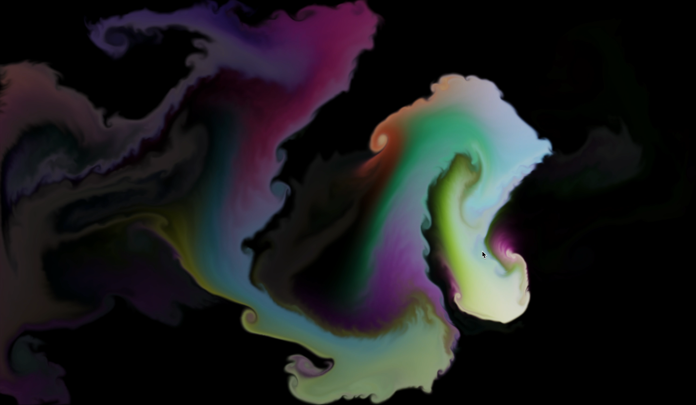

# Fluid-cursor

Небольшая GPU-симуляция «краски за курсором» на Three.js (WebGL2)




## 🚀 Быстрый старт

```sh
pnpm install
pnpm build:dev
pnpm start
```

Подключение компонента:

```tsx
import { FluidCanvas } from './fluid'

export default function App() {
    return <FluidCanvas />
}
```

## ✅ Требования

- WebGL2 (т.к. используются RedFormat, RGFormat, half-float рендеринг)
- Современный браузер с аппаратным ускорением (Chrome/Edge — предпочтительно)

## 🧪 Пайплайн

1. **Splat** — добавляет под курсором плотность (цвет) и импульс скорости.
2. **Advection (Velocity + Density)** — поток уносит и скорость, и цвета. Появляются хвосты и растяжки краски.
3. **Вихри (Curl + Vorticity)** — считает закрученность потока и аккуратно усиливает вихри. Появляется мелкая рябь и усиливаются завитки.
4. **Несжимаемость (Divergence + Pressure + Gradient subtract)** — убирает сжатие/расширение потока, делает движение более водяным и устойчивым.
5. **Display** — выводит плотность на экран.

Для текстур скорости/плотности используется пинг-понг: чтение из read, запись в write, затем swap().

## 🔧 Основные настройки (constants.ts)

**DOWNSAMPLE** — понижение разрешения симуляции

**VELOCITY_DISS** — затухание скорости

- Меньше → более вязко, меньше подтёков, движение тяжёлое/замедленное
- Больше → легче и быстрее, больше подтёков и мелких деталей, эффект более жидкий  
  _Реком.: 0.98–0.999_

**DENSITY_DISS** — выцветание краски

- Меньше → след быстро исчезает
- Больше → кадр забивается цветом  
  _Реком.: 0.97–0.995_

**PRESSURE_DISS** — память давления

- Меньше → сильнее гасим давление с прошлого кадра. Итог стабильнее, но обычно нужно больше **PRESSURE_ITERATIONS**
- Больше → больше «наследуем» давление. Можно выставлять меньше **PRESSURE_ITERATIONS**, но растёт риск артефактов  
  _Реком.: 0.95–0.985_

**PRESSURE_ITERATIONS** — итерации давления. _Реком.: 15–40_

**CURL_STRENGTH** — сила завитков. _Реком.: 2–20_

**COLOR_INTERVAL (мс)** — частота смены оттенка. _Реком.: 120–250_
